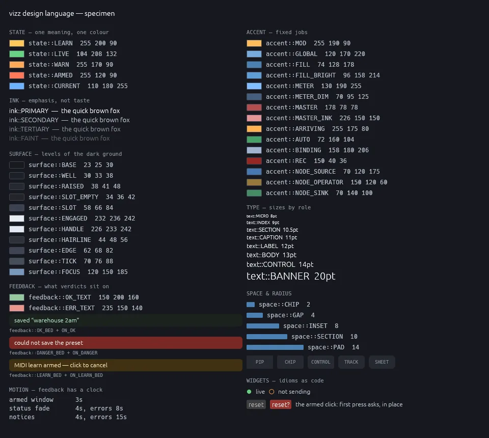

# The vizz design language

One crate — `crates/vizz-design` — holds the entire visual and
interaction vocabulary: colour roles, the text ramp, surfaces, accents,
feedback chrome, the type scale, spacing, radii, motion timings, and
the shared widgets that make the interaction idioms code rather than
convention. vizz consumes it everywhere; a sister app starts from the
identical language by adding one dependency.



The sheet above is generated, not drawn — `cargo run -p vizz-ui
--example render_specimen` — and regenerating it after a token change
is how the system is reviewed: by eye, on the dark ground it ships on,
the same way the vector renderer was accepted from its contact sheet.

## Where it comes from

The structure borrows from the two systems that got this right at
scale, and diverges where a dark-room instrument is not a phone:

- **From Material:** tokens are *roles*, not swatches. Nothing is
  named "orange"; things are named `WARN`. A screen that needs a
  colour not in the vocabulary is probably saying something new — the
  fix is to add the meaning, never a lookalike.
- **From Apple's HIG:** the ink ramp is semantic emphasis (primary /
  secondary / tertiary / faint — the shape of `label`,
  `secondaryLabel`, …), and filled states carry their "on" inks with
  them (`state::LEARN` + `state::ON_LEARN`), so text on a state chip
  is part of the token rather than a guess at the call site.
- **Not borrowed:** light mode, elevation shadows, adaptive type.
  This is an instrument read at a glance from across a stage, dark
  surfaces only, and its one typography rule that matters is that
  numbers which change every frame wear a monospace face and pad to
  fixed width, so the line never reflows under the eye.

## The vocabulary

- **`state`** — the five words of the state language, one colour per
  meaning: `LEARN` (a MIDI learn is waiting), `LIVE` (an output,
  input or clock is alive), `WARN` (attention, nothing armed),
  `ARMED` (the next press is destructive), `CURRENT` (the recalled
  preset, the playing pad). These began as `vizz-ui`'s theme module
  after the UX review found every screen carrying near-miss copies;
  `vizz_ui::theme` now re-exports this module unchanged.
- **`ink`** — the four-stop text ramp. Anything that matters is
  `PRIMARY` or `SECONDARY`; `FAINT` means "off" — including the
  hollow status dot of a source that is not sending.
- **`surface`** — levels of the dark ground (`BASE`, `WELL`,
  `RAISED`, the slot fills, the near-white `ENGAGED` of a lit punch
  button) and the structural greys (`HAIRLINE`, `EDGE`, `TICK`,
  `FOCUS`).
- **`accent`** — recurring non-state colours with fixed jobs:
  modulation amber, fader-value blues, meter blue, the master red,
  the autopilot green, the binding-chip blue, the recording family,
  the node-editor category hues.
- **`feedback`** — what verdicts sit on. Inline text (`OK_TEXT`,
  `ERR_TEXT` — errors must never share the success colour; that is
  how load failures once went unnoticed) and sheets (`OK_BED`,
  `DANGER_BED`, `LEARN_BED` with their `ON_*` inks) for notices, the
  quit prompt and the learn banner.
- **`text`, `space`, `radius`** — the scales, by role rather than by
  value: `text::BODY` not "13", `space::GAP` not "4",
  `radius::CONTROL` not "3".
- **`motion`** — feedback has a clock and the clock is part of the
  language: the 3-second armed window, the status fades (errors hold
  longer), the notice TTLs.
- **`widgets`** — idioms as code. `armed_button` is the app's one way
  to destroy something (first press relabels red in place and asks;
  the window lapsing disarms; arming one key in a group disarms the
  others). It replaced three hand-rolled copies of itself the day it
  was extracted. `status_dot` is the painted live/dead dot — painted
  because egui's default font has no ●, which was discovered the way
  everything here was discovered.

## The contracts

Rules that travel with the tokens, for any app speaking the language:

1. **One meaning, one colour** — and the converse: do not reuse a
   state colour for a non-state (a broken pad is `WARN`, never
   `ARMED`).
2. **Every control hovers.** The hover names the gesture and the
   state ("LATCHED — click to release"), not just the noun.
3. **Destructive clicks arm first**, through `widgets::armed_button`,
   with the idle hover ending "(asks once)".
4. **State is said in words as well as colour** where it matters —
   red against green is exactly the pair that collapses for
   colour-blind eyes.
5. **Changing numbers are monospace and padded**; layout must not
   move under the reader's eye.
6. **Decorative values stay local.** A colour becomes a token when
   one meaning appears in more than one place; computed glows and a
   specialised editor's chrome do not get hoisted into the system.

## Enforcement

The habit this repo trusts is tests that read source, and the design
system gets the same treatment: a test in `vizz-design` fails if any
file in `vizz-ui` restates a state colour (or the armed-red fill, or
the primary ink) as an rgb literal instead of using the token. That is
the specific drift that motivated the crate — three ambers, two
greens, two oranges, all "the same" colour — and it is now a compile
of `cargo test` away from impossible.

## Adopting it in a sister app

```toml
[dependencies]
vizz-design = { path = "../vizz/crates/vizz-design" }  # or workspace
```

Build screens from the tokens and widgets, follow the contracts, and
render your own specimen early — the sheet is the cheapest way to see
whether a new surface still reads as the same family. When the sister
app grows a meaning vizz does not have, the meaning goes into
`vizz-design` with a doc comment saying what it is for, and both apps
get it in the same release.
