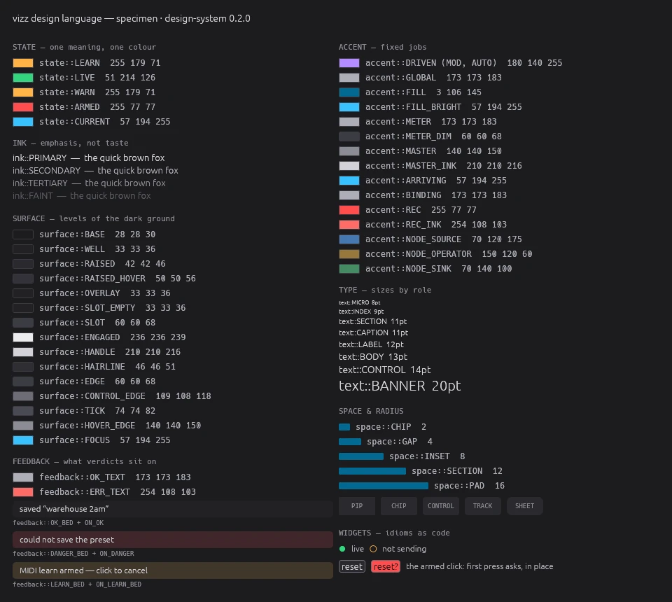

# The vizz design language

vizz speaks the studio's shared design system
([legofsalmon/design-system](https://github.com/legofsalmon/design-system)),
the same one LIGHT, crewbox, pixelmapmaker and st2110 use. One crate —
`crates/vizz-design` — is where it arrives: the system's tokens,
vendored as `tokens.rs`, and vizz's own vocabulary on top of them —
colour roles, the text ramp, surfaces, accents, feedback chrome, the
type scale, spacing, radii, motion timings, egui's own widgets drawn in
the shared states, and the shared widgets that make the interaction
idioms code rather than convention.

The sheet above is generated, not drawn — `cargo run -p vizz-ui
--example render_specimen` — and regenerating it after a token change
is how the system is reviewed: by eye, on the dark ground it ships on,
the same way the vector renderer was accepted from its contact sheet.

## Where it comes from

vizz-design began as vizz's own system, borrowing from Material (tokens
are *roles*, not swatches) and Apple's HIG (the ink ramp is semantic
emphasis, filled states carry their "on" inks). Its rules — one
meaning one colour, every control hovers, destructive clicks arm
first, state said in words, changing numbers in monospace — went into
the shared system, which now gives them back with its values, its
state model and its motion:

- **The grammar.** Neutral at rest; cyan is you (the current item, the
  selection, a toggle that is on); amber is attention (a warning, a
  learn waiting); red is stop (armed, failed, recording); green only
  where working has to be told from off (an output, a clock source).
  **Healthy is quiet:** a frame rate that is fine, a meter, "saved" —
  none of them is green.
- **The neutrals.** The surfaces and edges are the shared untinted
  greys. vizz's used to lean blue, and a tinted chrome shifts what the
  eye reads as white in the picture next to it.
- **The states.** egui's buttons, ticks, fields and menus draw rest,
  hover, pressed, focus, selected and disabled the shared way
  (`look::apply`), so the hand-painted deck and egui's widgets are one
  language rather than two.
- **Motion.** The shared durations and curves, and its reduced mode
  (`VIZZ_MOTION=reduced`, or macOS's Reduce motion), which keeps fades
  and drops travel.

**Not taken yet:** IBM Plex (the system does not ship the font files
yet, and egui's font stack would be its own change), the density sizes
for egui's controls (the deck is laid out by hand at desk sizes), and a
light theme. This is an instrument read in a dark room, so it is dark
only.

## The vocabulary

- **`state`** — the five words of the state language, one colour per
  meaning: `LEARN` (a MIDI learn is waiting), `LIVE` (an output,
  input or clock is alive), `WARN` (attention, nothing armed),
  `ARMED` (the next press is destructive), `CURRENT` (the recalled
  preset, the playing pad, a toggle that is on). `LEARN` and `WARN`
  share the attention amber; a waiting learn is told from a broken
  pad by its words and its breathing rim. `vizz_ui::theme`
  re-exports this module unchanged.
- **`ink`** — the four-stop text ramp. Anything that matters is
  `PRIMARY` or `SECONDARY`; `TERTIARY` is for hints and units on the
  surfaces content sits on, never on a raised control; `FAINT` means
  "off" — including the hollow status dot of a source that is not
  sending.
- **`surface`** — levels of the dark ground (`BASE`, `WELL`, `GROOVE`,
  `RAISED`, `OVERLAY`, the slot fills, the near-white `ENGAGED` of a
  lit punch button) and the structural greys (`HAIRLINE`, `EDGE`,
  `CONTROL_EDGE`, `TICK`, the `HOVER_EDGE` that firms under a pointer,
  and the keyboard `FOCUS` ring).
- **`accent`** — recurring non-state colours with fixed jobs:
  `DRIVEN` (violet: something other than your hand is driving this —
  a modulator, the autopilot), the fader fills (the accent's deep step,
  capped in the accent), the neutral meters and master, the recording
  family, the node-editor category hues.
- **`feedback`** — what verdicts sit on. Inline text (`OK_TEXT` is
  neutral, `ERR_TEXT` is the stop ink — errors never share the success
  colour; that is how load failures once went unnoticed) and sheets
  (`OK_BED`, `DANGER_BED`, `LEARN_BED` with their `ON_*` inks) for
  notices, the quit prompt and the learn banner. The beds are the
  shared washes flattened onto the floating surface, because a
  translucent sheet over a strobing picture strobes with it.
- **`text`, `space`, `radius`** — the scales, by role rather than by
  value: `text::BODY` not "13", `space::GAP` not "4",
  `radius::CONTROL` not "3". Space is the shared 4-point grid, radii
  the shared compact (desk) density; `MICRO` and `INDEX` stay vizz's
  own, under the shared floor, for chips riding on a 40-point pad.
- **`motion`** — feedback has a clock and the clock is part of the
  language: the 3-second armed window, the 4-second success, failures
  that stay until dismissed or replaced, and the transition durations
  for the mode this machine asked for.
- **`look`** — egui's `Visuals` from the shared roles. Call
  `look::apply` once on the context.
- **`widgets`** — idioms as code. `armed_button` is the app's one way
  to destroy something (first press relabels red in place and asks;
  the window lapsing or the pointer leaving disarms; arming one key in
  a group disarms the others). It replaced three hand-rolled copies of
  itself the day it was extracted. `status_dot` is the painted
  live/dead dot — painted because egui's default font has no ●, which
  was discovered the way everything here was discovered.

## The contracts

The shared system's behaviour rules apply in full
([principles](https://github.com/legofsalmon/design-system/blob/main/docs/principles.md#behaviour));
these are the ones a change here meets most:

1. **One meaning, one colour** — and the converse: do not reuse a
   state colour for a non-state (a broken pad is `WARN`, never
   `ARMED`).
2. **Every control hovers.** The hover names the gesture and the
   state ("LATCHED — click to release"), not just the noun.
3. **Destructive clicks arm first**, through `widgets::armed_button`,
   with the idle hover ending "(asks once)".
4. **State is said in words as well as colour** where it matters —
   red against green is exactly the pair that collapses for
   colour-blind eyes.
5. **Changing numbers are monospace and padded**; layout must not
   move under the reader's eye.
6. **Failures stay; successes go.** A notice that says something
   failed stays until it is clicked away.
7. **Decorative values stay local.** A colour becomes a token when
   one meaning appears in more than one place; computed glows and a
   specialised editor's category hues do not get hoisted into the
   system.

## Enforcement

The habit this repo trusts is tests that read source, and the design
system gets the same treatment. A test in `vizz-design` fails if any
file in `vizz-ui` restates a state colour (or the armed-red fill, the
primary ink, the driven violet or the ground) as an rgb literal instead
of using the token, in decimal or hex. That is the specific drift that
motivated the crate — three ambers, two greens, two oranges, all "the
same" colour. Another fails if a colour in `vizz-design` is a literal
rather than a shared token, unless it is one of vizz's own meanings
with its reason written down.

CI checks the vendored `tokens.rs` against its stamp
(`python3 scripts/design-system.py --check`), so a hand edit fails; the
fix belongs in the design-system repository. To take a new version of
the system, check it out beside this repository and run
`python3 scripts/design-system.py --sync`.

## Changing it

A change to what a person sees starts from the design system's
`docs/designing.md` (see `CLAUDE.md`). A new meaning vizz needs goes
into `vizz-design` with a doc comment saying what it is for; when a
second app needs the same meaning, it moves into the shared system.
