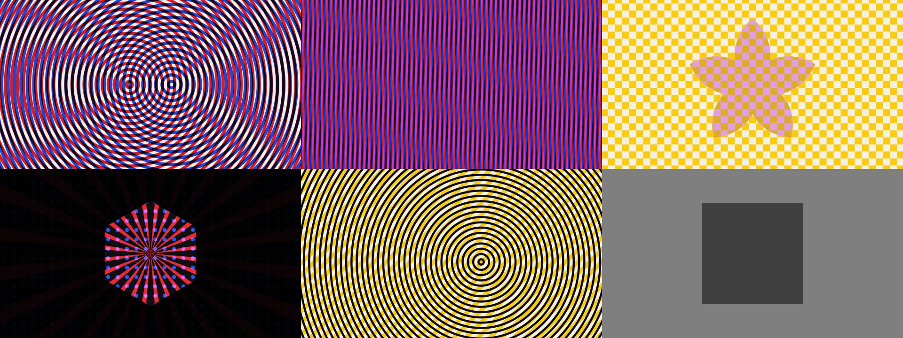
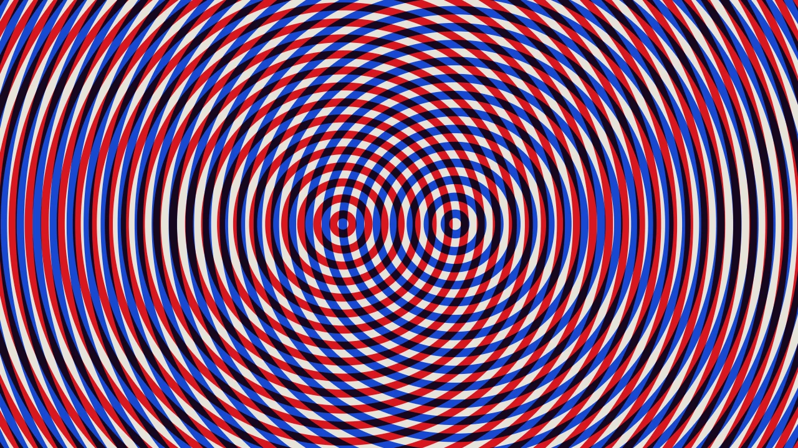

# Vector layers — design note

An investigation prototype, now merged behind defaults that keep it
invisible until asked for: hard-edged procedural pattern layers — the
print-look counterpart to the particle field — inspired by 555-5555's
visuals for Caribou's live shows. Rings, stripes, checkerboards,
polygons, stars, rays and dot grids in flat ink colours, layered with
multiply/screen/difference-style blends, interfering into moiré.

## What shipped

- `crates/vizz-render/src/vector.rs` + `src/shaders/vector.wgsl`: a
  `VectorScene` drawing a fixed stack of 8 layers in one fullscreen
  pass. The registry exposes 4 (`/l1/…`–`/l4/…`, 15 parameters each)
  plus a shared four-ink palette (`/pal/0..3/r|g|b`). Paper colour is
  the existing `/bg/*`.
- The pass renders first into the post chain's scene texture and takes
  over the clear when any layer is on; room and particles load on top.
  All layers off — the default — skips the pass entirely, so a fresh
  launch renders byte-identical frames to the pre-vector app.
- Because the layers are ordinary parameters, everything already built
  works on them unwired: OSC, MIDI learn, presets, scene-grid morphing
  (kind and blend are unsmoothed+labelled, so transitions flip them at
  the midpoint — `scene.rs`'s existing switch rule), the modulation
  graph (a square LFO into `/l2/opacity` is a strobe with zero renderer
  work), and the panel, which grew four collapsible groups by itself.

## Decisions, and the alternatives they beat

**One über-shader, compositing in-register.** The stack is small and
fixed; blend modes are exact in float with no intermediate textures;
moiré appears at fragment rate. Rejected: vello (heavy dependency,
built for retained scenes, not procedural fields), lyon + MSAA
(geometry churn in a codebase that deliberately has no MSAA), per-layer
ping-pong passes (needed only if layers become unbounded or want
render-to-texture sources).

**Analytic pixel-footprint AA, no `fwidth`.** Derivatives lie at
exactly the discontinuities these patterns are made of (`fract` wraps,
`atan2`'s branch cut). Every layer transform is a similarity transform
and the kaleido fold an isometry, so one scalar "pattern units per
pixel" propagates by chain rule and each generator supplies its own
gradient magnitude. Verified at 4× zoom: one-pixel linear coverage
ramps, no staircase, no seams. Past Nyquist the footprint exceeds the
period and coverage converges to duty-cycle tone — moiré survives,
sparkle aliasing dissolves.

**Blending in sRGB-encoded space.** Multiply/screen on encoded values
is the print-era compositor behaviour this aesthetic grew out of; the
one conversion to linear happens at shader exit. Verified byte-exact:
mid-grey multiplied over mid-grey paper reads 64 (the encoded product)
in a rendered frame, where linear blending would read ~56 and a missing
exit conversion ~188.

**Behind the particles, inside the feedback chain.** Trails, zoom,
punch and recording all apply to the stack for free, and
`/particles/count 0` gives a pure vector show. Measured cost of that
placement: the composite tone-map shoulder takes bright flat colour
down ~5% (ink 0.92 lands at byte 223 instead of 237). Acceptable; if it
ever isn't, the recorded alternative is a second `VectorScene` bound to
the output format, rendered after post as a clean overlay — the type
already takes its target format as a parameter for exactly this.

## Sharp edges worth knowing

- The **rays** generator's footprint diverges at the centre; radius is
  clamped at 0.02 so the hub converges to flat tone. **Checker**
  corners are coverage-XOR, one softened pixel at the four-way points.
- Sweeping `/lN/blend` or `/lN/kind` from a gliding controller steps
  through modes on the way — the same accepted behaviour as
  `/shape/mode`, and pack-time rounding means no frame is ever between
  modes.
- The stack paints opaque. The transparent-master routing feature
  (`/bg/alpha`) applies only while every layer is off.
- OSC test scripts: an OSC string is NUL-terminated *then* padded —
  always 1–4 NULs. A modulo pad that appends zero bytes for 4-aligned
  addresses (`/l1/kind` is 8 bytes) produces packets rosc drops
  silently. This cost an hour of this investigation; `scripts/`'s
  existing pad is correct.

## Deferred, deliberately

Performance-view layer controls; vector looks among the built-in
presets; a shipped audio-reactive default patch; the after-post overlay
mode; a "video" layer kind sampling the existing live-video texture;
registry layers 5–8 (the shader capacity is already there); docs-site
prose (the OSC tables are already enforced and current).
